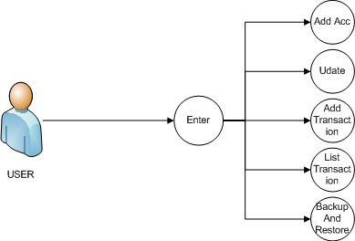

# “Personal Account Assistance"
Personal Account assistant is android project which i have completed on my university course.
```
“Personal Account Assistance" is the system that manage personal bank account transaction. In this era we have more than one Bank account. We need to manage them and sometime we cannot memories all transaction so our application keep all transaction we can easily memories them. In this project we keep backup and restore system so that user can keep data safely from delete.
```
# Description and Advantage
```
- - Reduced the manual work by generating reports. 
- - Proposed system is user friendly so it is easy to operate.
- - save time. 
- - Ensure data security 
- - Store the account and transaction information effectively.
```
## Use case

